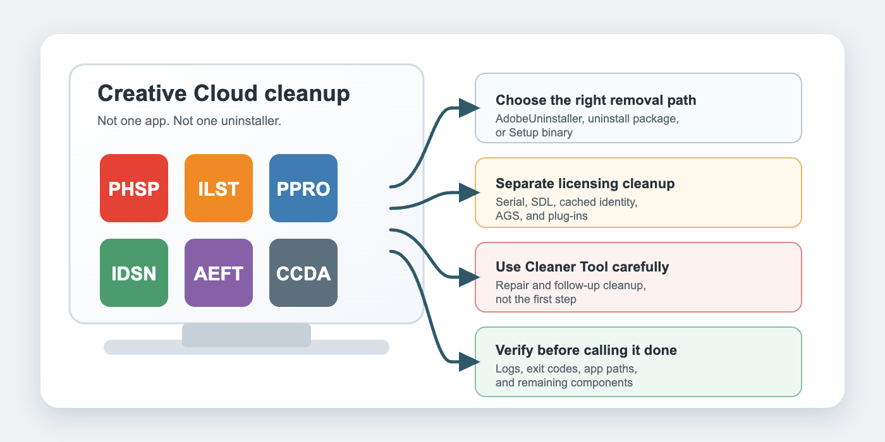
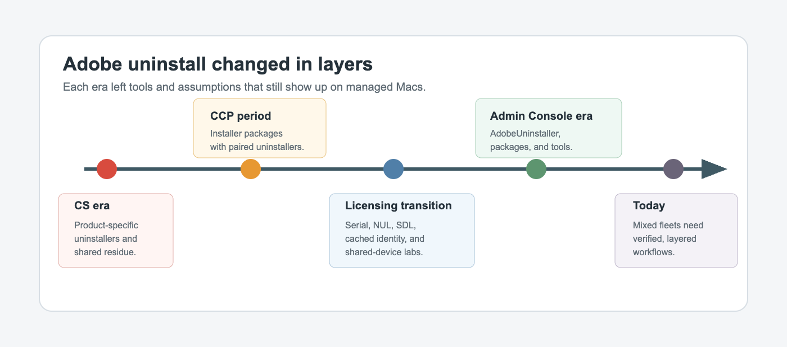
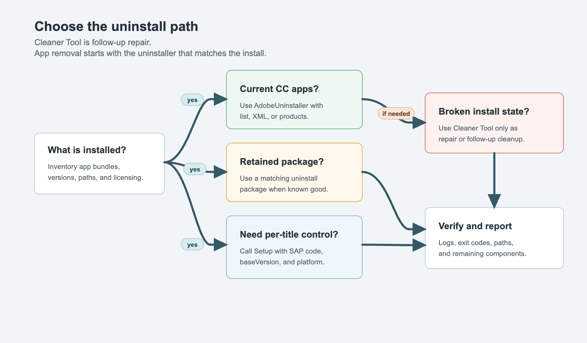
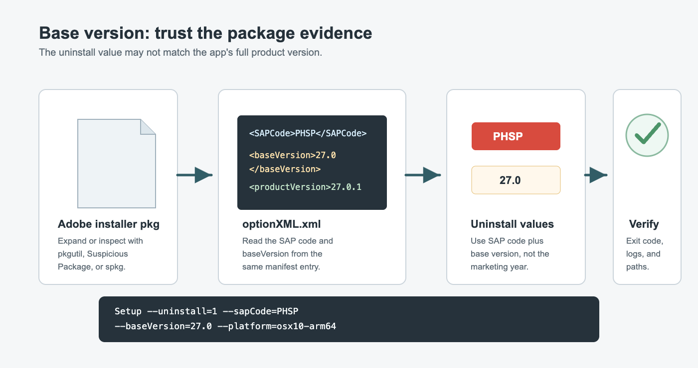
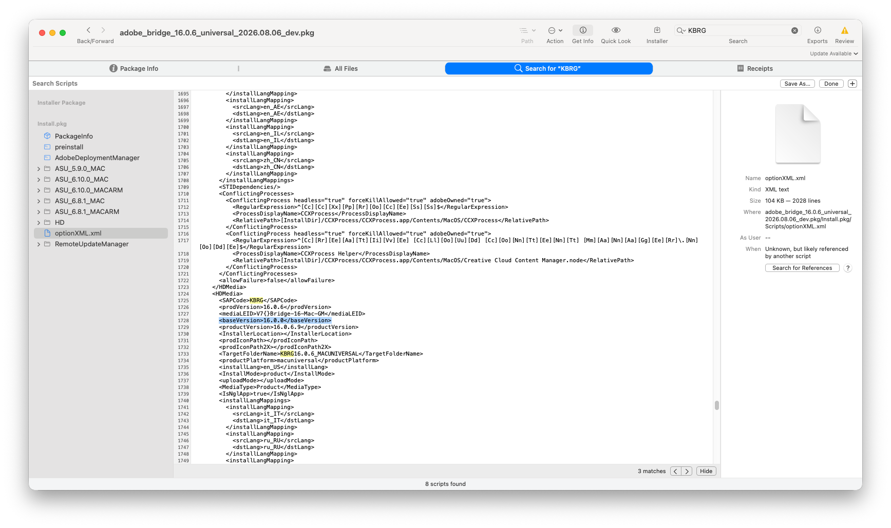

# Uninstalling Adobe on macOS: A Character-Building Exercise



Uninstalling Adobe Creative Cloud apps on macOS has improved in pieces, but it has never become one clean, consistent lifecycle. For MacAdmins, that means the real problem is rarely "how do I delete Photoshop?" It is usually a messier question: which Adobe tool applies to this app, this license model, this architecture, this install source, and this version history?

In practice, the uninstall decision tree starts before you run any command. Is this app from an Admin Console package, a legacy package workflow, Jamf App Installers, or user-driven Creative Cloud Desktop install? Is the device Intel or Apple silicon? Is licensing named user, shared device, feature-restricted, or a migration leftover? Those details often determine whether a standard uninstall succeeds, partially removes components, or fails with a message that points in the wrong direction.

That is why Adobe uninstall conversations keep resurfacing in MacAdmin spaces. The desired outcome sounds simple: remove old Creative Cloud apps, clean up licensing state, prepare a lab for the next semester, or rebuild a device without dragging years of Adobe residue forward. The hard part is doing that without relying on the wrong cleanup tool, losing track of SAP codes and base versions, or assuming one Adobe app behaves like the next one.

At scale, the stakes are operational, not just cosmetic. A lab refresh can stall because one title keeps self-repairing. A rebuild can look complete while shared components, launch agents, or licensing remnants quietly survive and break the next install. A "cleanup" step that is too aggressive can also remove data needed for support diagnostics or trigger preventable reinstall loops. That is why experienced MacAdmins treat Adobe removal as evidence-based change management: verify package evidence, map each app to the right uninstall path, log results, and keep rollback options ready.

## Key Topics

- Why Adobe uninstall has stayed inconsistent across macOS releases.
- How the history of CS, Adobe Creative Cloud Packager, Adobe Admin Console packages, and shared-device licensing shaped today's workflows.
- Why the Adobe Creative Cloud Cleaner Tool should not be treated as the primary uninstaller.
- How Adobe's current uninstall tool (`AdobeUninstaller`), uninstall packages, and the `Setup` executable fit together.
- What MacAdmins Slack `#adobe` discussions reveal about recurring failure modes.
- Why the Marriott Library built a per-app Adobe CC uninstaller wrapper for Jamf Pro.

## A Short History of Adobe Uninstall on macOS



Adobe uninstall methods evolved in phases, not as one stable enterprise model. Each phase left behind tooling, assumptions, and old installs that admins still have to account for.

The CS era leaned heavily on product-specific uninstallers and application-specific behavior. Some apps removed cleanly. Some left shared components. Some workflows required follow-up cleanup in `/Library/Application Support/Adobe`, user caches, licensing stores, or application folders that the uninstaller did not touch.

Adobe Creative Cloud Packager improved deployment for many enterprise environments by letting admins build installer and uninstaller packages. That was a useful model when the package artifacts were retained and when the uninstall package matched the installed generation of apps. It was less useful years later when admins inherited machines without the original uninstallers or needed to remove a mix of apps installed by different packaging methods.

The 2018-2020 licensing transition made the problem more complicated. Serial licensing, device licensing, named-user licensing, shared-device licensing, and later feature-restricted licensing overlapped in real environments. In the MacAdmins Slack Adobe channel, this period is full of conversations about removing serial state, moving labs to shared-device licensing, clearing cached licensing data, and understanding whether an uninstall problem was really an app problem or a license-state problem.

The Adobe Admin Console era brought better packaging, newer deployment options, and a dedicated command-line Adobe uninstall tool. That is progress. But it did not erase older app footprints, inconsistent app behavior, missing uninstall artifacts, plug-in leftovers, or confusion between uninstall tools and repair tools.

The current state is better than the old days, but it is still not one command for every case.

## Why Adobe Uninstall Is Inconsistent

MacAdmins run into inconsistency because "Adobe Creative Cloud" is not one app. It is a family of apps, services, licensing components, helper tools, plug-ins, package formats, and update mechanisms that changed over time.

- **Different tools solve different problems.** `AdobeUninstaller`, Adobe Creative Cloud Packager uninstall packages, the version-specific `Setup` executable, Adobe Extension Manager command-line tool, Adobe Genuine Service (AGS) cleanup, and the Creative Cloud Cleaner Tool are related, but they are not interchangeable.
- **Install source matters.** An app installed from an Adobe Admin Console package, a pre-generated package, the Creative Cloud desktop app, Jamf App Installers, or an older CCP package may not respond the same way to the same uninstall attempt.
- **Version matching matters.** Adobe uninstall commands often need the SAP code and base version, not just the marketing year or full product version.
- **License state can outlive the app.** Removing the app bundle is not the same as removing cached sign-in state, shared-device state, serial state, or Adobe Genuine Service (AGS).
- **Plug-ins are separate.** Creative Cloud app uninstall methods do not necessarily remove plug-ins or third-party extension ecosystems.
- **Old application folders may remain.** Community reports repeatedly mention uninstallers removing registration state or helper pieces while leaving parts of the application folder behind.
- **Architecture is now part of the puzzle.** Apple Silicon, Intel, Universal packages, Rosetta-dependent components, and platform tokens such as `osx10-64` and `osx10-arm64` can affect whether a version-targeted uninstall matches the installed app.

In practice, most reliable workflows become layered: run the correct uninstaller first, clean licensing or repair state only when needed, verify the filesystem afterward, and keep a record of what each title requires.

## Lessons From the MacAdmins Adobe Channel

The MacAdmins Slack `#adobe` channel shows the same operational themes over and over. The specific tools change, but the shape of the problem stays familiar.

- **Cleaner Tool confusion is common.** Admins often reach for the Creative Cloud Cleaner Tool when they want to uninstall everything. Adobe's own enterprise documentation says the Cleaner Tool is for fixing installation problems and is not the primary way to uninstall apps.
- **"Remove everything" comes up constantly.** The channel has recurring requests for a silent, reliable way to remove all CS and CC apps from a Mac. The answer is usually some combination of Adobe uninstallers, package-era uninstall artifacts, Cleaner Tool follow-up, and verification.
- **Old versions stack up.** Admins still report machines with several generations installed side by side, such as 2023 through 2026 releases. That creates storage pressure, patching confusion, user confusion, and policy drift.
- **Labs magnify every edge case.** Shared labs have many users, limited disk, heavy app payloads, shared-device licensing, cloud-sync concerns, and semester-based rebuild timelines. A method that works on one assigned staff Mac may not scale cleanly across art labs or classrooms.
- **Licensing leftovers look like uninstall failures.** Reports about expired grace licenses, cached Adobe ID state, `SLCache`, `SLStore`, serial removal, and shared-device transitions show that app removal and license cleanup are separate work.
- **Base-version documentation needs verification.** The channel includes recent examples where an uninstall command failed with one documented base version but succeeded with the base version found from the package evidence.
- **Jamf and MDM behavior needs testing.** Admins ask whether Jamf App Installers, Jamf App Catalog, Mosyle, Adobe Admin Console packages, and pre-generated packages behave reliably in environments that previously had Creative Cloud desktop app installs or older Adobe packages.

The lesson is not that Adobe uninstall is impossible. It is that Adobe uninstall should be treated as a tested workflow, not a single remembered command.

## The Adobe Uninstall Tool



Adobe's current enterprise documentation leads with the command-line Adobe uninstall tool, whose executable is `AdobeUninstaller`, from **Adobe Admin Console > Packages > Tools** for Creative Cloud products.

List installed apps and versions:

```bash
sudo ./AdobeUninstaller --list
sudo ./AdobeUninstaller --list --format=XML
sudo ./AdobeUninstaller --list --products=ILST,APRO
```

Uninstall everything, including the Creative Cloud desktop app:

```bash
sudo ./AdobeUninstaller --all
```

The Creative Cloud desktop app is a special case: Adobe documents that it can be removed with `--all`, not through the app-specific `--products` option.

Uninstall specific products by SAP code and base version:

```bash
sudo ./AdobeUninstaller --products=PHSP#22.0,ILST#25.0
sudo ./AdobeUninstaller --products=PHSP#22.0,ILST#25.0 --skipNotInstalled
```

Or drive removal from an XML export:

```bash
sudo ./AdobeUninstaller --list --format=XML
sudo ./AdobeUninstaller --uninstallConfigPath=/path/to/list.xml --skipNotInstalled
```

The `--skipNotInstalled` option matters in mixed fleets. Without it, Adobe documents that the command can fail when one of the requested SAP codes is invalid or not installed. In a lab, classroom, or long-lived staff fleet, that is exactly the kind of mismatch you should expect.

## The Cleaner Tool Is Not the Main Uninstaller

The Adobe Creative Cloud Cleaner Tool is useful, but it is often used for the wrong job.

Adobe describes it as a cleanup tool for fixing installation or update problems caused by corrupted installs, damaged files, or bad permissions. Adobe also states that it is not the means to uninstall applications and points admins back to the Creative Cloud uninstall documentation for app removal.

That distinction matters. A practical workflow should usually look like this:

1. Uninstall the app with `AdobeUninstaller`, a retained uninstall package, or a version-aware `Setup` command.
2. Use the Cleaner Tool only as a follow-up for broken installs, failed reinstalls, bad cleanup state, or difficult legacy cases.
3. Verify logs and filesystem remnants before reinstalling or declaring the Mac clean.

The Cleaner Tool can generate XML and run in silent workflows, so it can be tempting to promote it into the primary removal method. For fleet work, that temptation is where trouble starts.

## Base Versions Are the Quiet Failure Point



Adobe uninstall commands often need a base version. That value is not always the same as the full app version shown in Finder, Jamf inventory, `CFBundleShortVersionString`, or Adobe's marketing release notes.

Adobe publishes a Creative Cloud application base-version reference and also documents a way to check the base version inside an Adobe Admin Console package. For macOS packages, the key evidence is the package's `optionXML.xml`.

For example, an installer manifest can include entries like:

```xml
<SAPCode>KBRG</SAPCode>
<prodVersion>16.0.6</prodVersion>
<mediaLEID>V7{}Bridge-16-Mac-GM</mediaLEID>
<baseVersion>16.0.0</baseVersion>
<productVersion>16.0.6.9</productVersion>
```

In that example, the value to use for a version-targeted uninstall is the base version, `16.0.0`, not the full product version, `16.0.6.9`.

This is also where local verification beats copy-and-paste. Use installer/package evidence to confirm uninstall inputs, and log the SAP code, base version, platform token, and exit code for every attempted title.

## Verifying Base Versions From Packages

When a base-version value looks wrong, inspect the installer package instead of trusting memory.

A repeatable command-line method:

```bash
rm -rf /tmp/adobe_pkg_verify
pkgutil --expand-full "/path/to/Adobe_Installer.pkg" /tmp/adobe_pkg_verify

# Set the SAP code for the app you are targeting (examples: KBRG, PHSP, ILST)
SAP_CODE="KBRG"
find /tmp/adobe_pkg_verify -name optionXML.xml \
  -exec grep -nH -A 8 -B 2 "<SAPCode>${SAP_CODE}</SAPCode>" {} \;
```

Then search `optionXML.xml` for the app's SAP code and read the nearby `baseVersion` value.

### When There Are Multiple `baseVersion` Matches

One easy mistake, whether you are using Suspicious Package, `pkgutil --expand-full`, `spkg`, or another package-inspection method, is searching for `baseVersion`, finding several matches, and copying the first one that looks plausible. Adobe packages can include multiple components, helper payloads, architecture-specific payloads, update components, or bundled dependencies. That means `optionXML.xml` may contain more than one `baseVersion` key.

The value you want is the `baseVersion` inside the same `<HDMedia>` block as the application you are trying to uninstall.

Use this checklist:

1. Expand or inspect the installer package first so you are searching the package evidence, especially `optionXML.xml`.
2. Search for the app's SAP code first, not `baseVersion`. For Bridge, search for `KBRG`; for Photoshop, search for `PHSP`; for Illustrator, search for `ILST`.
3. Confirm you are inside an `<HDMedia>` block for the target app.
4. Read the nearby fields together: `SAPCode`, `prodVersion`, `mediaLEID`, `baseVersion`, and `productVersion`.
5. Use the `baseVersion` from that same block in the uninstall command.
6. Do not use a `baseVersion` from a neighboring helper component, language pack, update component, or a different architecture block.

### 2026 Apps and Package-Verified Values

As of this draft, on August 8, 2026, Adobe's Creative Cloud application base-version reference was last updated on April 15, 2026. The reliable workflow is to expand or inspect the installer package, search `optionXML.xml` for the target SAP code, and use the `baseVersion` from that app's own `<HDMedia>` block.

The Marriott Library 2026 Adobe CC uninstaller script tracks the current uninstall values this way:

| Application | SAP code | Package-verified/script value |
| --- | --- | --- |
| Adobe After Effects 2026 | `AEFT` | `26.0` |
| Adobe Illustrator 2026 | `ILST` | `30.3` |
| Adobe InCopy 2026 | `AICY` | `21.3` |
| Adobe InDesign 2026 | `IDSN` | `21.3` |

The important distinction is that Adobe's reference page is useful for identifying SAP codes and expected product families, while the package manifest provides title-specific confirmation for uninstall inputs.

In Suspicious Package, a good visual check is to select the block from `<SAPCode>` through `<productVersion>` for the target app, like this:



```xml
<HDMedia>
  <SAPCode>KBRG</SAPCode>
  <prodVersion>16.0.6</prodVersion>
  <mediaLEID>V7{}Bridge-16-Mac-GM</mediaLEID>
  <baseVersion>16.0.0</baseVersion>
  <productVersion>16.0.6.9</productVersion>
</HDMedia>
```

For that Bridge package, the uninstall value is `KBRG#16.0.0`, not another `baseVersion` found elsewhere in the file.

If you are checking from the command line, print context around the SAP code instead of searching for every `baseVersion` globally:

```bash
grep -n -A 8 -B 2 "<SAPCode>KBRG</SAPCode>" /tmp/adobe_pkg_verify/Install.pkg/Scripts/optionXML.xml
```

If there are multiple matches for the same SAP code, compare `prodVersion`, `mediaLEID`, `productVersion`, and architecture/package naming before choosing. In that case, document the evidence you used in the script comment or change record, because future-you will appreciate the breadcrumb.

Here is a real-world pattern from an Adobe Bridge package. The package name may be `adobe_bridge_16.0.6_universal`, but the first `baseVersion` hits in `optionXML.xml` are not necessarily Bridge. They can belong to shared Adobe components:

```xml
<HDMedia>
  <SAPCode>COSY</SAPCode>
  <prodVersion>7.8.10</prodVersion>
  <mediaLEID>V7{}CoreSync-2.4.1-Mac-GM</mediaLEID>
  <baseVersion>2.4.1</baseVersion>
  <productVersion>7.8.10.1</productVersion>
  <TargetFolderName>COSY7.8.10_MACARM</TargetFolderName>
  <productPlatform>macarm64</productPlatform>
</HDMedia>
```

That `baseVersion` is for CoreSync, not Bridge. A little later, the same package may also include other helper/product blocks such as `ACR`, `LIBS`, or `CCXP`. Those are useful package evidence, but they are not the uninstall target if your goal is Bridge.

The Bridge block is the one where the SAP code is `KBRG`:

```xml
<HDMedia>
  <SAPCode>KBRG</SAPCode>
  <prodVersion>16.0.6</prodVersion>
  <mediaLEID>V7{}Bridge-16-Mac-GM</mediaLEID>
  <baseVersion>16.0.0</baseVersion>
  <productVersion>16.0.6.9</productVersion>
  <TargetFolderName>KBRG16.0.6_MACUNIVERSAL</TargetFolderName>
  <productPlatform>macuniversal</productPlatform>
</HDMedia>
```

For this package, the Bridge uninstall target is therefore:

```text
KBRG#16.0.0
```

Or, with the `Setup` executable:

```bash
sudo "/Library/Application Support/Adobe/Adobe Desktop Common/HDBox/Setup" \
  --uninstall=1 \
  --sapCode=KBRG \
  --baseVersion=16.0.0 \
  --platform=osx10-64 \
  --deleteUserPreferences=false
```

Because this example package is universal, test the platform token in your environment. If `osx10-64` does not match on Apple Silicon, try the platform token your installer evidence and Adobe tooling expect, such as `osx10-arm64`, and log which one succeeds.

Suspicious Package is also useful here. Open the Adobe installer package, switch to **All Scripts**, select `optionXML.xml`, and inspect the SAP code and base version directly. The same rule applies if you expand the installer with `pkgutil --expand-full` and search from Terminal: search for the target SAP code first, then read the surrounding block. The bundled `spkg` CLI can create manifests and component-package summaries that are easier to diff and save with change records:

```bash
spkg --show-component-packages "/path/to/Adobe_Installer.pkg"
spkg --quiet --manifest "/path/to/output.spkg-manifest.txt" "/path/to/Adobe_Installer.pkg"
spkg --reveal-scripts "/path/to/Adobe_Installer.pkg"
spkg --difftool "/path/to/Old_Installer.pkg" "/path/to/New_Installer.pkg"
```

That evidence-first habit is useful beyond Adobe. It is the same habit described in the Marriott Library companion post on using Suspicious Package and AI to build better macOS uninstallers.

## Different Apps Need Different Uninstall Paths

This is why a reliable Adobe cleanup workflow usually becomes a small map of methods instead of one universal command. Even inside the same Adobe fleet, the right uninstall path can differ by product family, install source, and the evidence left on disk.

Some examples from the Marriott Library workflow:

| App or app family | Local Jamf/app key example | Primary method | Why it differs |
| --- | --- | --- | --- |
| Photoshop, Illustrator, InDesign, InCopy, Bridge, After Effects | `adobe_creative_cloud_application` with an app parameter such as `PHOTOSHOP` or `BRIDGE` | Version-aware `Setup` call with SAP code and package-verified `baseVersion` | These apps often need a specific SAP code/base-version pair, so verify values from the package manifest for the exact installer in use. |
| Adobe Acrobat / Acrobat DC | `adobe_acrobat_dc` | `AdobeUninstaller --products=APRO`, then Acrobat's bundled remover if needed | Acrobat is not handled like most Creative Cloud app bundles in the local workflow. The local Acrobat script uses Adobe's command-line uninstall tool first and then looks for Acrobat's built-in `com.adobe.Acrobat.RemoverTool`. |
| Adobe Acrobat Reader / Reader DC | `adobe_acrobat_reader_dc` | Reader-specific Jamf uninstall policy and path verification; use Acrobat-family remover logic only when that remover is actually present | Adobe's public Reader uninstall path differs from Acrobat Pro/DC, and Reader may live in a different location. Treating Reader and Acrobat Pro as the same install can miss one or remove the wrong target. |
| Broken installs, failed reinstalls, or leftover repair state | Follow-up remediation, not the first uninstall policy | Creative Cloud Cleaner Tool or targeted cleanup only after the supported uninstaller path | Cleaner Tool is useful after the main uninstall path fails or leaves bad state, but it should not be the default app-removal method for every title. |

That is the operational reason to keep separate Jamf policy triggers such as `adobe_acrobat_dc_uninstall`, `adobe_acrobat_reader_dc_uninstaller`, and a parameter-driven Adobe CC application uninstaller. The policy name should describe the intent, while the script decides which Adobe mechanism fits that app.

## Calling the Setup Executable Directly

For version-targeted removal, Adobe also documents calling the `Setup` executable directly:

```bash
sudo "/Library/Application Support/Adobe/Adobe Desktop Common/HDBox/Setup" \
  --uninstall=1 \
  --sapCode=PHSP \
  --baseVersion=23.0 \
  --platform=osx10-64 \
  --deleteUserPreferences=false
```

This is lower-level than using the Adobe uninstall tool, but it can be useful when you need an app-by-app wrapper, when retained uninstall packages are missing, or when you want Jamf parameters to decide which title and generation to remove.

The dangerous part is also the useful part: you are responsible for supplying the right SAP code, base version, and platform token. If those values are wrong, the command may fail, do nothing, or return an exit code that only makes sense after you compare it with logs and package evidence.

## Case Study: Marriott Library Per-App Uninstaller

Because Adobe's uninstall methods do not cover every mixed-fleet reality cleanly, the J. Willard Marriott Library built a Jamf-oriented Adobe CC application uninstaller script around the `Setup` executable.

The script is designed for lab and shared-use Macs where Adobe apps may have been installed over multiple years, where not every original uninstall package is still available, and where admins need to remove either one title or a whole Adobe CC catalog from Jamf Pro.

### Where to Get the Script (GitHub)

For teams that want to reuse this workflow outside of an existing Jamf script library, the Marriott Library script is published in:

`https://github.com/univ-of-utah-marriott-library-apple/adobe-cc-uninstall`

Direct script URL:

`https://github.com/univ-of-utah-marriott-library-apple/adobe-cc-uninstall/blob/main/adobe_cc_app_uninstaller.sh`

Using a stable repo name and file path makes policy docs, runbooks, and automation references easier to maintain.

#### Access from a Web Browser

1. Sign in to GitHub with an account that has access to the repository.
2. Open the repository URL:

  `https://github.com/univ-of-utah-marriott-library-apple/adobe-cc-uninstall`

3. Open the script page:

  `https://github.com/univ-of-utah-marriott-library-apple/adobe-cc-uninstall/blob/main/adobe_cc_app_uninstaller.sh`

4. Use **Raw** to view plain text, or **Download** to save a copy.
5. Use **History** to review line-by-line changes over time.

#### Access with GitHub Desktop

1. Open GitHub Desktop and sign in.
2. Select **File > Clone repository**.
3. Use the URL tab and enter:

  `https://github.com/univ-of-utah-marriott-library-apple/adobe-cc-uninstall.git`

4. Choose a local destination and click **Clone**.
5. Click **Show in Finder** or **Open in Visual Studio Code**.
6. Open the script at repo root (`adobe_cc_app_uninstaller.sh`) or open the direct script page:

  `https://github.com/univ-of-utah-marriott-library-apple/adobe-cc-uninstall/blob/main/adobe_cc_app_uninstaller.sh`

#### Access with Git CLI

Clone the repository:

```bash
git clone https://github.com/univ-of-utah-marriott-library-apple/adobe-cc-uninstall.git
cd adobe-cc-uninstall
```

Verify remotes and current branch:

```bash
git remote -v
git branch --show-current
git status
```

Open or preview the script:

```bash
ls
sed -n '1,120p' adobe_cc_app_uninstaller.sh
```

Direct script page for quick access:

`https://github.com/univ-of-utah-marriott-library-apple/adobe-cc-uninstall/blob/main/adobe_cc_app_uninstaller.sh`

If your organization uses SSH instead of HTTPS, clone with:

```bash
git clone git@github.com:univ-of-utah-marriott-library-apple/adobe-cc-uninstall.git
cd adobe-cc-uninstall
```

The structure is intentionally explicit:

- One `UNINSTALL_<APP_NAME>` function per Adobe title.
- A SAP code for each title.
- A current base version for each title.
- An array of previous base versions for cleanup of older releases.
- A version scope of `ALL` or `PREVIOUS`.
- A Jamf parameter for choosing one app or the full catalog.
- Logging around each `Setup` attempt and exit status.

The core pattern looks like this:

```bash
"${ADOBE_CC_SETUP_PATH}" \
  --uninstall=1 \
  --sapCode="${ADOBE_CC_SAP_CODE}" \
  --baseVersion="${ADOBE_CC_TARGET_BASE_VERSION}" \
  --platform="${ADOBE_CC_PLATFORM}" \
  --deleteUserPreferences=false
```

That design does not replace Adobe's current uninstall tool. It gives the library a practical fallback for cases where the installed reality on disk does not match a clean Adobe Admin Console story.

## Photoshop as the Emerging Script Pattern

The most recently revised Photoshop logic in the Marriott Library script adds two improvements that are worth carrying into the rest of the app functions.

- **Check for the app first.** The script searches the custom Adobe CC parent path and `/Applications` before firing version-by-version uninstall attempts. That avoids running a long list of `Setup` commands against apps that are not present.
- **Handle Apple Silicon platform tokens.** On Apple Silicon, the script can try `osx10-arm64` before falling back to `osx10-64`, with an override available for edge cases.

Those changes match the current Adobe reality: app presence, architecture, and package evidence are part of the uninstall decision.

## Jamf Pro Deployment Pattern

The script is intended to live once in Jamf Pro's script library and be reused by policy parameters.

- **Parameter 4: application scope.** Use `ALL` or a single app key such as `PHOTOSHOP`, `ILLUSTRATOR`, `PREMIERE_PRO`, `LIGHTROOM_CLASSIC`, or `INDESIGN`.
- **Parameter 5: version scope.** Use `ALL` to remove the current and previous tracked base versions, or `PREVIOUS` to remove superseded versions while leaving the current version installed.

That lets one script support multiple policies:

- Remove old Photoshop versions without touching the current release.
- Clean up older Adobe CC generations before a semester starts.
- Tear down all Adobe apps before rebuilding a lab image.
- Run targeted remediation after a failed upgrade or licensing transition.

The important part is that policy intent stays visible in Jamf, while the SAP code and base-version details stay centralized in the script.

## Practical Workflow for MacAdmins

A durable Adobe uninstall workflow should be boring, logged, and repeatable.

1. Inventory installed Adobe apps from both expected and custom paths.
2. Decide whether the goal is app removal, old-version cleanup, license cleanup, or repair.
3. Prefer Adobe's uninstall tool (`AdobeUninstaller`) for current supported Creative Cloud uninstall workflows.
4. Use retained uninstall packages when they are known to match the installed package generation.
5. Use version-aware `Setup` calls when you need per-title control or retained uninstallers are unavailable.
6. Verify SAP codes and base versions from `optionXML.xml` when documentation or behavior is questionable.
7. Treat the Cleaner Tool as repair/follow-up cleanup, not the main uninstaller.
8. Handle Adobe Genuine Service (AGS) and plug-ins separately when they are in scope.
9. Test on Intel and Apple Silicon Macs.
10. Log commands, exit codes, Adobe logs, app paths, and remaining filesystem evidence.

For labs, add a few more checks:

- Confirm the uninstall can finish before rebuild or class-use windows.
- Avoid pulling massive reinstall payloads over the WAN during business hours.
- Decide whether old versions should be removed before or after new versions install.
- Test with the actual shared-device or named-user licensing model in use.
- Confirm user-facing launch behavior after reinstall, not just package installation success.

## A Generic Adobe Cleanup Pattern

Here is the plain-language flow I would want in any Adobe uninstall automation:

```text
collect installed Adobe apps
collect Adobe licensing and helper component state
choose uninstall scope
confirm Adobe apps and background processes are not running
verify the uninstall tool exists
verify SAP code and base version for each target
run the supported uninstaller for each target
capture logs and exit codes
run targeted follow-up cleanup only when needed
verify app bundles and key Adobe paths afterward
report what was removed, skipped, or left behind
```

The boring shape is the point. Adobe cleanup has enough surprises already; the automation should not add more.

## References

- Adobe: Uninstall Creative Cloud products (Enterprise): <https://helpx.adobe.com/enterprise/using/uninstall-creative-cloud-products.html>
- Adobe: Creative Cloud Cleaner Tool for enterprise users: <https://helpx.adobe.com/enterprise/kb/cc-cleaner-tool-for-enterprise-users.html>
- Adobe: Creative Cloud application base versions: <https://helpx.adobe.com/business/enterprise/kb/adobe-cc-app-base-versions.html>
- Adobe: Shared Device Licensing deployment guide: <https://helpx.adobe.com/business/enterprise/plan-your-deployment/deployment-guides/sdl-deployment-guide.html>
- Adobe: Uninstall Adobe Acrobat on Windows and macOS: <https://helpx.adobe.com/acrobat/desktop/get-started/access-the-app/uninstall-acrobat.html>
- Adobe: Uninstall Acrobat Reader on Windows and macOS: <https://helpx.adobe.com/acrobat/desktop/get-started/access-the-app/uninstall-reader.html>
- Suspicious Package: <https://www.mothersruin.com/software/SuspiciousPackage/>
- Marriott Library: Using Suspicious Package and AI to Build Better macOS Uninstaller: <https://apple.lib.utah.edu/using-suspicious-package-and-ai-to-build-better-macos-uninstaller/>
- University of Utah MacAdmins Meeting, February 2019: <https://apple.lib.utah.edu/february-2019-macadmins-meeting/>
- MacAdmins Foundation and Slack join page: <https://www.macadmins.org/>

Adobe uninstall is not one problem. It is packaging history, licensing history, app-specific behavior, and fleet operations all meeting at the same command line. The most reliable MacAdmin response is to make the workflow explicit: know what you are removing, know which Adobe tool applies, verify the version evidence, and leave enough logs for the next admin to understand what happened.
